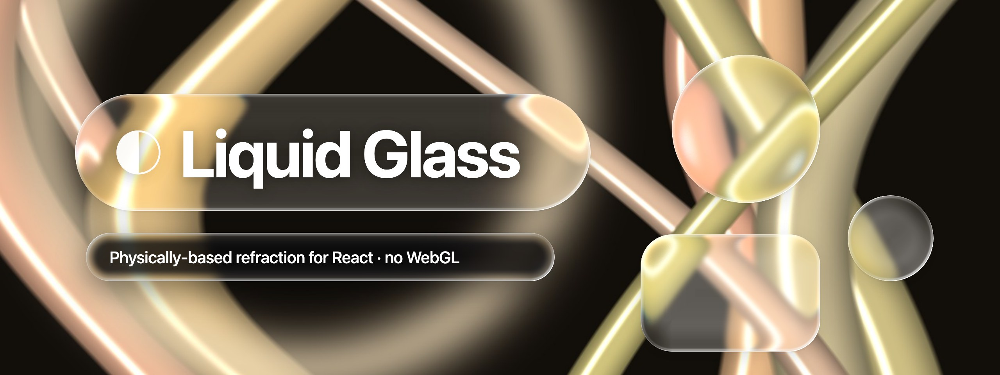
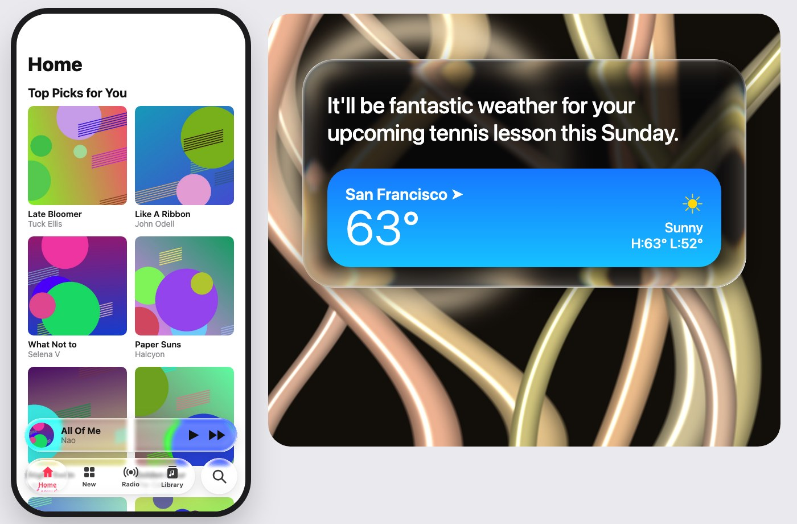
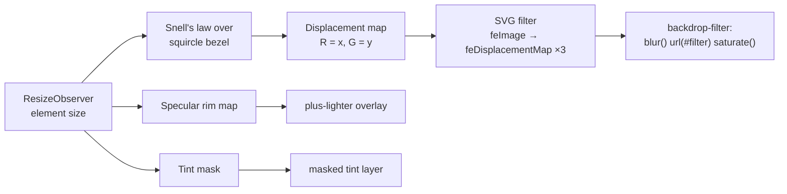
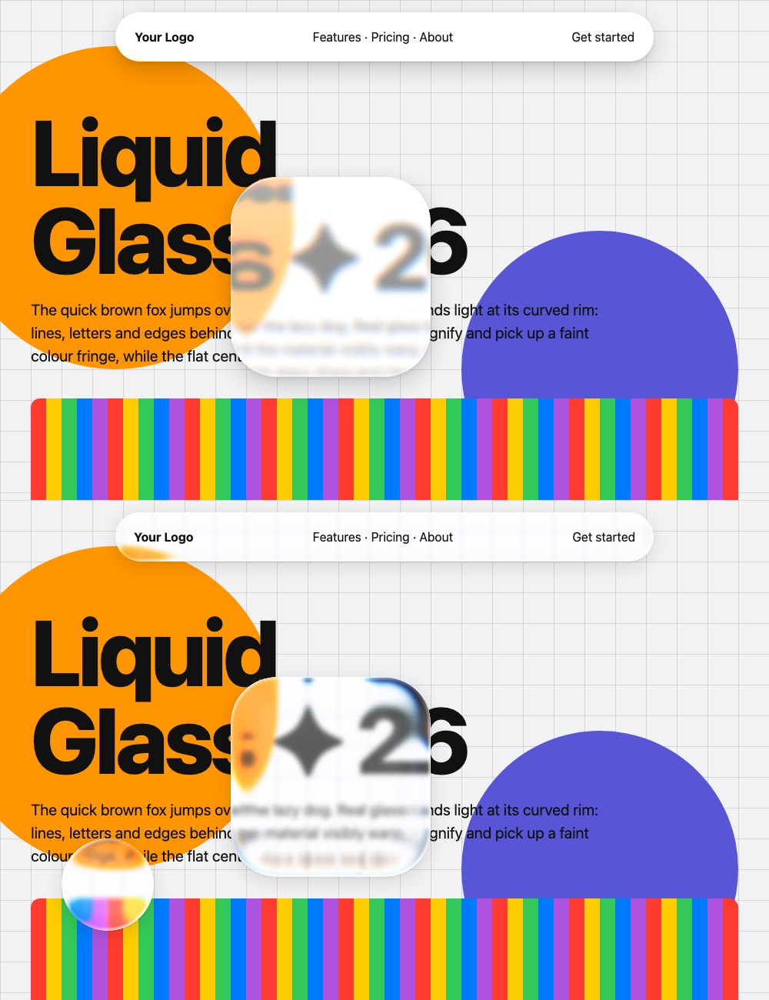
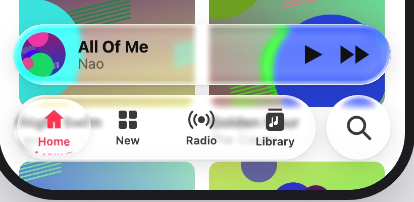
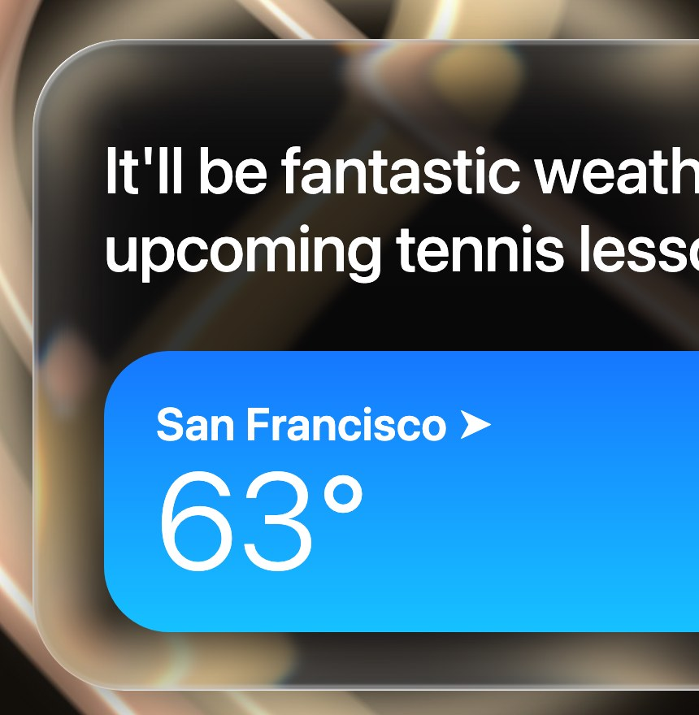

<p align="center">
  
</p>

<h1 align="center">Liquid Glass for React</h1>

<p align="center">
  Apple's iOS 26 / macOS 26 <b>Liquid Glass</b> material for the web.<br/>
  Physically based refraction, a specular rim and touch-reactive glass.<br/>
  No WebGL, no canvas snapshots, no per-frame JavaScript.
</p>

<p align="center">
  <a href="https://www.npmjs.com/package/@vepando/liquid-glass-react"></a>
  <a href="https://bundlephobia.com/package/@vepando/liquid-glass-react"></a>
  
  
  
  
  
</p>

---

Most "liquid glass" CSS on the web is `backdrop-filter: blur()` in a
rounded box. Real Liquid Glass **bends light**: the centre stays clear,
while the curved rim magnifies and stretches whatever is behind it and
catches a bright edge highlight.

This library models that rim as an actual lens. It traces light through
it with **Snell's law**, writes the result into an SVG displacement map
sized to each element, and lets the browser apply it in its normal
`backdrop-filter` pass.

```bash
npm install @vepando/liquid-glass-react
```

```tsx
import "@vepando/liquid-glass-react/style.css"
import { LiquidGlass } from "@vepando/liquid-glass-react"

<LiquidGlass radius={999} interactive style={{ height: 64 }}>
  <nav>…</nav>
</LiquidGlass>
```

<p align="center">
  
</p>

## Contents

- [Features](#features)
- [Install](#install)
- [Usage](#usage)
- [Props](#props)
- [How it works](#how-it-works)
- [Browser support](#browser-support)
- [Gotchas](#gotchas)
- [Static / zero-JS variant](#static--zero-js-variant)
- [Demo](#demo)
- [Before and after](#before-and-after)
- [Credits](#credits)

## Features

- **Physically based refraction.** The rim is a convex squircle bezel.
  Rays are refracted at n = 1.5 and traced down to the content beneath.
  The centre stays undistorted and the rim magnifies.
- **Pixel-exact maps per element.** Each map is generated for the
  element's measured size and regenerated on resize, so the bend sits
  right on the curve whatever the shape.
- **Clear rim, tinted centre.** The tint fades out across the bezel, so
  the refracted backdrop shows bright at the edge, as in Apple's glass.
- **Angle-dependent specular.** A crisp edge line plus a soft inner glow
  that follows a configurable light direction.
- **Chromatic dispersion.** R, G and B bend by slightly different amounts
  for a faint colour fringe on high-contrast edges.
- **Touch interaction.** `interactive` adds a springy press-to-grow and a
  glow from the touch point.
- **Light and dark tints**, or any CSS colour.
- **SSR safe.** A frosted fallback renders on the server and upgrades on
  mount, without hydration mismatches.
- **Cheap.** Maps are built once per size (a few ms for a pill, about
  45 ms for a large panel) and cached; identical controls share them.
- **Zero dependencies.** React 18+ is the only peer dependency. ESM +
  CJS + TypeScript types, about 5 KB gzipped.

## Install

```bash
npm install @vepando/liquid-glass-react
# or: pnpm add @vepando/liquid-glass-react · yarn add @vepando/liquid-glass-react · bun add @vepando/liquid-glass-react
```

Import the stylesheet **once**, e.g. in your root layout or entry file:

```tsx
import "@vepando/liquid-glass-react/style.css"
```

Then use the component anywhere:

```tsx
import { LiquidGlass } from "@vepando/liquid-glass-react"
```

**Next.js App Router:** the bundle is already marked `"use client"`, so
you can render `<LiquidGlass>` straight from a server component. Put the
CSS import in `app/layout.tsx`. Tested with `next build` and React 18/19
SSR.

**Prefer to own the code?** The source is three files in [`src/`](src).
The copy-paste version in
[`skills/liquid-glass/assets/`](skills/liquid-glass/assets) works without
the package.

## Usage

**Floating navbar**

```tsx
<LiquidGlass radius={999} className="h-16 w-full max-w-3xl">
  <nav className="h-full flex items-center justify-between px-6">…</nav>
</LiquidGlass>
```

**Round icon button**

```tsx
<LiquidGlass radius={999} interactive role="button" aria-label="Search" className="h-16 w-16">
  <SearchIcon />
</LiquidGlass>
```

**Dark sheet / panel**

```tsx
<LiquidGlass radius={56} tint="dark" className="p-12">
  <p className="text-white text-4xl">It'll be fantastic weather…</p>
</LiquidGlass>
```

**Glass on glass (e.g. a tab bar selection droplet).** Render the inner
glass as a *sibling* positioned over the outer one, not as a child (see
[Gotchas](#gotchas)):

```tsx
<div className="relative">
  <LiquidGlass radius={999} className="h-16">{tabs}</LiquidGlass>
  <div className="absolute inset-1 pointer-events-none">
    <LiquidGlass radius={999} blur={0} tint="rgba(255,255,255,.05)"
      style={{ width: "25%", height: "100%", transform: `translateX(${active * 100}%)` }} />
  </div>
</div>
```

A full working version, including the stretch while it slides, is in
[`demo/src/Scenes.tsx`](demo/src/Scenes.tsx).

## Props

| Prop | Default | Description |
| --- | --- | --- |
| `radius` | `32` | Corner radius in px. `999` for pills and circles. |
| `bezel` | auto | Width of the curved, light-bending rim. Auto ≈ ¼ of the short side, capped by `radius` and 56. |
| `thickness` | `1.5 × bezel` | Glass height. Taller glass bends more. |
| `ior` | `1.5` | Index of refraction (water ≈ 1.33). |
| `profile` | `"squircle"` | Rim surface: `"squircle"`, `"circle"` or `"lip"`. |
| `refraction` | `1` | Multiplier on top of the physical bend. |
| `dispersion` | `0.06` | Colour separation. `0` disables it (single filter pass). |
| `blur` | `3` | Frost in px. `0` = perfectly clear glass. |
| `saturation` | `1.5` | Backdrop vibrancy. |
| `tint` | `"light"` | `"light"`, `"dark"` or any CSS colour. |
| `specular` | `1` | Edge highlight strength, 0-1. |
| `lightAngle` | `-135` | Light direction in degrees (-90 = top, -135 = top-left). |
| `interactive` | `false` | Press-to-grow and touch glow. |

Every other `div` prop (`className`, `style`, `onClick`, `role`, …) is
passed through.

## How it works



1. **Optics.** For each distance across the bezel, the surface slope of
   the squircle profile gives a normal. A straight-down view ray is
   refracted into the glass and followed to the content plane. The
   sideways offset is the displacement: 0 on the flat plateau, large near
   the edge.
2. **Map.** That 1-D curve is swept around the rounded-rect outline along
   the inward normal and encoded into R/G, where 128 means no shift.
   `feDisplacementMap` then samples the backdrop from further inside the
   glass near the rim, which reads as magnification.
3. **Compositing.** The filter is referenced from `backdrop-filter` on the
   component root. A masked tint, the specular map
   (`mix-blend-mode: plus-lighter`) and your content sit on top.

The deep dive is in
[`skills/liquid-glass/references/theory.md`](skills/liquid-glass/references/theory.md).

## Browser support

| Engine | Result |
| --- | --- |
| **Blink**: Chrome, Edge, Arc, Brave, Opera | Full effect: refraction, dispersion, specular, frost |
| **WebKit**: Safari and every iOS browser | Frosted fallback: blur, tint and specular rim, no refraction |
| **Gecko**: Firefox | Same frosted fallback |

Only Blink renders SVG filters referenced from `backdrop-filter`. The
other engines accept the syntax but draw nothing, so a CSS cascade
fallback isn't reliable there. The component detects Blink and only adds
`url(#filter)` there.

## Gotchas

> **No refraction at all, the page just shows through the glass?** You
> have a *backdrop root* in the way.

- An ancestor with `filter`, `opacity < 1`, `mask`, `clip-path`,
  `mix-blend-mode`, `backdrop-filter`, or children that blend into it,
  cuts the backdrop off at that ancestor. The glass then refracts an empty
  image. That's why `backdrop-filter` sits on the component root, never on
  an inner layer. `transform` and `overflow: hidden` are fine.
- **Glass inside glass can't see the outer glass's refraction.** Use
  siblings positioned on top (see [Usage](#usage)).
- **Give the glass something to bend.** Over a flat colour, any glass
  looks like a tinted rectangle. Refraction shows over images, text and
  edges.

## Static / zero-JS variant

For fixed-size elements, the same optics are available as a Python script
that writes a PNG and prints the matching `scale`:

```bash
pip install -r scripts/requirements.txt
python3 scripts/generate-displacement-map.py --width 700 --height 64 --radius 32 \
  --output public/liquid-lens-map.png
# → Use it with: <feDisplacementMap scale="24.0" xChannelSelector="R" yChannelSelector="G" />
```

Generate the map at the element's **exact** CSS size; a stretched map
puts the bend in the wrong place.

## Demo

```bash
cd demo
npm install
npm run dev
```

| URL | Scene |
| --- | --- |
| `/?scene=music` | Apple Music style tab bar with sliding droplet, mini player and search button over album art |
| `/?scene=siri` | Dark glass panel over a ribbon wallpaper |
| `/?scene=playground` | Draggable lenses over text, stripes and a grid |
| `/?scene=banner` | The header image of this README |
| `/?scene=original` | The v1 technique, for comparison |

Every prop can be tuned from the URL, for example
`/?scene=playground&thickness=80&dispersion=0.2&blur=0`.

The demo imports `@vepando/liquid-glass-react` by name; Vite aliases that name to
`src/`, so you get HMR on the library source without a build step.

## Before and after

<table>
  <tr>
    <th>v1: one stretched static map, milky tint</th>
    <th>v2: physical, per-element, clear rim</th>
  </tr>
  <tr>
    <td width="50%"></td>
    <td width="50%">
      <br/>
      
    </td>
  </tr>
</table>

## For AI coding agents

[`skills/liquid-glass/`](skills/liquid-glass) is a self-contained skill
(`SKILL.md`, assets and theory) that you can hand to Claude Code or any
other coding agent to implement the effect end-to-end, including the
troubleshooting table for the common failure modes.

## Repository layout

```
src/                  the package: LiquidGlass.tsx · maps.ts · liquid-glass.css · index.ts
dist/                 build output (npm run build), published to npm
examples/             LiquidGlassPill.tsx
demo/                 Vite + React showcase
scripts/              generate-displacement-map.py (static variant)
skills/liquid-glass/  skill for AI coding agents
docs/                 images used in this README
```

## Credits

The refraction model follows the approach described by kube.io in
[*Liquid Glass in the browser: refraction with CSS and SVG*](https://kube.io/blog/liquid-glass-css-svg/).
Liquid Glass is a design language by Apple; this project is not
affiliated with Apple.

## Development

```bash
npm install
npm run build      # tsup → dist/ (ESM, CJS, .d.ts, style.css)
npm run typecheck
cd demo && npm install && npm run dev
```

Publishing: `npm publish` (runs typecheck and build first via
`prepublishOnly`).

## License

[MIT](LICENSE)
